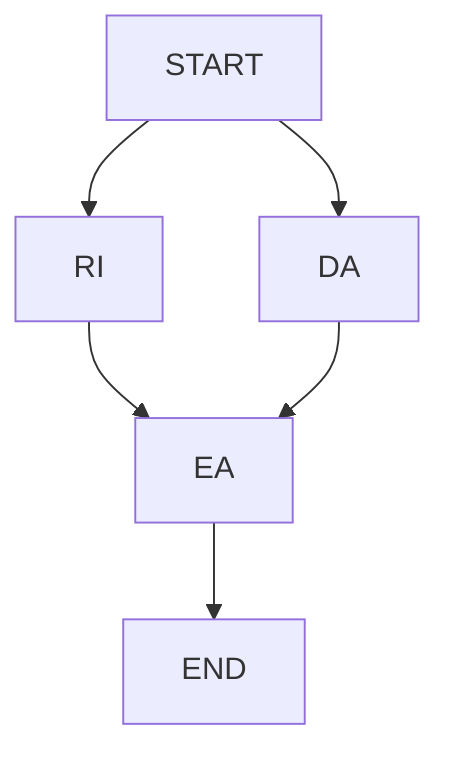
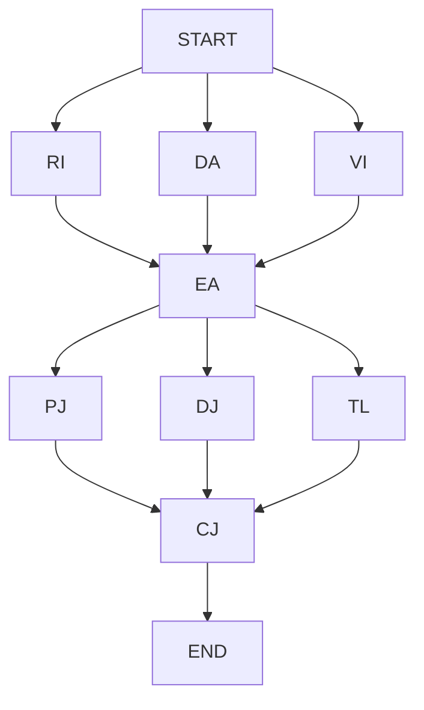

# Automaton Auditor: Project Overview and Architecture

## 1. What This Project Is About

`Automaton Auditor` is a governance-focused code auditing system built for Week 2 of the challenge.  
Its goal is to move from simple code generation workflows to **automated evaluation workflows**.

Instead of asking "Can an AI write code?", this project asks:

- Can a system inspect repositories and reports with evidence-first logic?
- Can it produce auditable findings with traceable rationale?
- Can it support a multi-agent courtroom model where evidence is separated from judgment?

At interim stage, the implementation is intentionally scoped to the **Detective Layer**:

- collect structured forensic evidence from code and documents
- synchronize evidence in a fan-in node
- output an auditable interim report

## Master Thinker Architecture: Brain vs Tools

The system adheres to a strict division of labor to maximize speed, cost-efficiency, and reasoning depth without hallucination:

1. **🔨 Forensics (The Detectives)**: *Zero LLMs used.*
   - We use Python AST (Abstract Syntax Trees) and generic Subprocess/Regex tooling for the `RepoInvestigator` and `DocAnalyst`. 
   - This prevents hallucination: the system either finds the code structure/evidence or it doesn't. Hard facts only.
2. **⚖️ The Judicial Layer (The Brain)**: *DeepSeek V3 (`deepseek-chat`)*
   - We save "AI Brain Power" for the Prosecutor, Defense, and Tech Lead roles. DeepSeek V3 excels at nuanced Dialectical Synthesis over the hard evidence facts.
3. **👁️ Vision**: *Gemini 2.5 Pro*
   - Used specifically by the `VisionInspector` for diagram analysis.

The judicial and synthesis layers are present in code modules but not wired into the core interim runtime graph.

---

## 2. Problem Statement

At scale, humans cannot manually review every artifact produced by many autonomous coding agents.
The bottleneck becomes **quality governance**, not generation.

This project addresses that by building a LangGraph workflow that:

1. inspects codebase structure (state, graph topology, git narrative, safety patterns)
2. inspects report/document content (citations and conceptual depth)
3. produces structured evidence objects and execution logs

---

## 3. Current Scope (Interim)

### In scope

- Typed state contracts and reducers
- Repo forensic tooling
- Document ingestion and chunked query tooling (RAG-lite)
- Parallel detective nodes with fan-in aggregation
- Markdown + JSON interim outputs

### Out of scope for interim runtime

- Judicial scoring nodes in graph execution
- Chief-justice deterministic final verdict in graph execution
- End-to-end final courtroom report

---

## 4. Architecture at a Glance

## 4.1 Interim runtime flow (implemented)

Legend:

- `RI`: RepoInvestigator
- `DA`: DocAnalyst
- `EA`: EvidenceAggregator

This is a **fan-out -> fan-in** pattern.

### 4.2 Target full courtroom flow (planned/partially scaffolded)

Legend:

- `VI`: VisionInspector
- `PJ`: Prosecutor
- `DJ`: Defense
- `TL`: TechLead
- `CJ`: ChiefJustice

---

## 5. Core Components

## 5.1 State and contracts

File: `src/state.py`

Defines:

- `Evidence` (`BaseModel`)
- `JudicialOpinion` (`BaseModel`)
- `AgentState` (`TypedDict`)

Reducers in `AgentState`:

- `evidences: Annotated[dict[str, Evidence], operator.ior]`
- `opinions: Annotated[list[JudicialOpinion], operator.add]`
- `logs: Annotated[list[str], operator.add]`

Why this matters:

- parallel nodes can safely merge state
- contracts reduce schema drift and hidden assumptions
- evidence and opinions stay machine-verifiable

## 5.2 Repository forensics

File: `src/tools/repo_tools.py`

Capabilities:

- `resolve_repo(...)`: supports local path or sandboxed URL clone using `tempfile.TemporaryDirectory()`
- `extract_git_history(...)`: extracts hash, timestamp, message
- `analyze_graph_structure(...)`: AST-based `add_edge` analysis for fan-out/fan-in signals
- forensic protocols:
  - state structure check
  - graph wiring check
  - git narrative check
  - security pattern scan

Design intent:

- avoid brittle regex-only architecture checks
- avoid executing untrusted code
- keep evidence reproducible and citation-friendly

## 5.3 Document forensics (RAG-lite)

File: `src/tools/doc_tools.py`

Capabilities:

- `ingest_pdf(...)`: chunked PDF extraction
- `query_pdf_chunks(...)`: lightweight token-frequency retrieval
- `protocol_citation_check(...)`: cross-check path claims against repo inventory
- `protocol_concept_verification(...)`: concept checks for dialectics/metacognition terms

Design intent:

- large report text is chunked before analysis
- targeted query over chunks avoids dumping full PDF context

## 5.4 Detective nodes

File: `src/nodes/detectives.py`

Nodes:

- `run_repo_investigator(...)`
- `run_doc_analyst(...)`
- `run_evidence_aggregator(...)`

Responsibilities:

- Detectives produce only evidence/logs, not final scores
- Aggregator confirms combined evidence coverage and logs readiness status

## 5.5 Graph orchestration

File: `src/graph.py`

Uses `StateGraph(AgentState)` with:

- two parallel start edges (`RepoInvestigator`, `DocAnalyst`)
- fan-in to `EvidenceAggregator`
- terminate at `END`

This is the core interim pattern required by the assignment.

## 5.6 CLI and report output

Files:

- `src/main.py`
- `src/reporting.py`

CLI inputs:

- `--repo`
- `--report`
- `--rubric`

Outputs:

- `audit/interim_detective_report.md`
- `audit/interim_detective_report.json`

---

## 6. How LangGraph Is Used

LangGraph is the orchestration engine for stateful multi-node execution.

This project uses it for:

1. **State-first execution**
   - Shared typed state (`AgentState`) moves through nodes.
2. **Parallel branching**
   - Detective nodes branch from `START`.
3. **Fan-in synchronization**
   - `EvidenceAggregator` receives outputs from multiple upstream branches.
4. **Deterministic graph topology**
   - Node sequencing and dependencies are explicit in `add_edge(...)`.
5. **Composable growth path**
   - Interim graph can be extended with judicial and synthesis layers without redesigning state contracts.

---

## 7. How LangChain Is Used

LangChain is used in the judicial modules (`src/nodes/judges.py`) for LLM-based structured scoring logic.

Key patterns used:

- `ChatPromptTemplate` for judge prompts
- `ChatOpenAI` model clients
- `.with_structured_output(...)` to enforce schema-shaped results

Current status:

- LangChain judicial nodes exist and are scaffolded for Prosecutor/Defense/TechLead behavior.
- Interim runtime does not route through judges; this is reserved for final phase integration.

---

## 8. Security and Reliability Choices

1. **Sandboxed repository cloning**
   - URL targets are cloned into temporary directories and cleaned up.
2. **No shell interpolation in clone command**
   - subprocess argument arrays are used.
3. **AST-based static inspection**
   - avoids executing target repository code.
4. **Graceful error capture in protocols**
   - failed repo resolution returns structured evidence instead of hard crash.
5. **Deterministic evidence schema**
   - every protocol emits a uniform `Evidence` object.

---

## 9. Interim Deliverables Mapping

This repository currently provides the required interim artifacts:

- `src/state.py`
- `src/tools/repo_tools.py`
- `src/tools/doc_tools.py`
- `src/nodes/detectives.py`
- `src/graph.py`
- `pyproject.toml` + `uv.lock`
- `.env.example`
- `README.md`
- `reports/interim_report.pdf`

---

## 10. Next Architecture Steps

To progress from interim to final courtroom system:

1. Add judicial layer fan-out and structured retry handling.
2. Add chief-justice deterministic synthesis routing.
3. Expand rubric coverage and per-criterion dissent/remediation outputs.
4. Add full audit artifact directories for self/peer/by-peer reports.
5. Attach LangSmith trace evidence for reasoning-loop observability.

---

## 11. One-Line Summary

This project is a typed, evidence-first LangGraph governance system that already delivers a robust interim detective pipeline and is structurally prepared to expand into a full multi-agent digital courtroom with LangChain-driven judicial reasoning.
