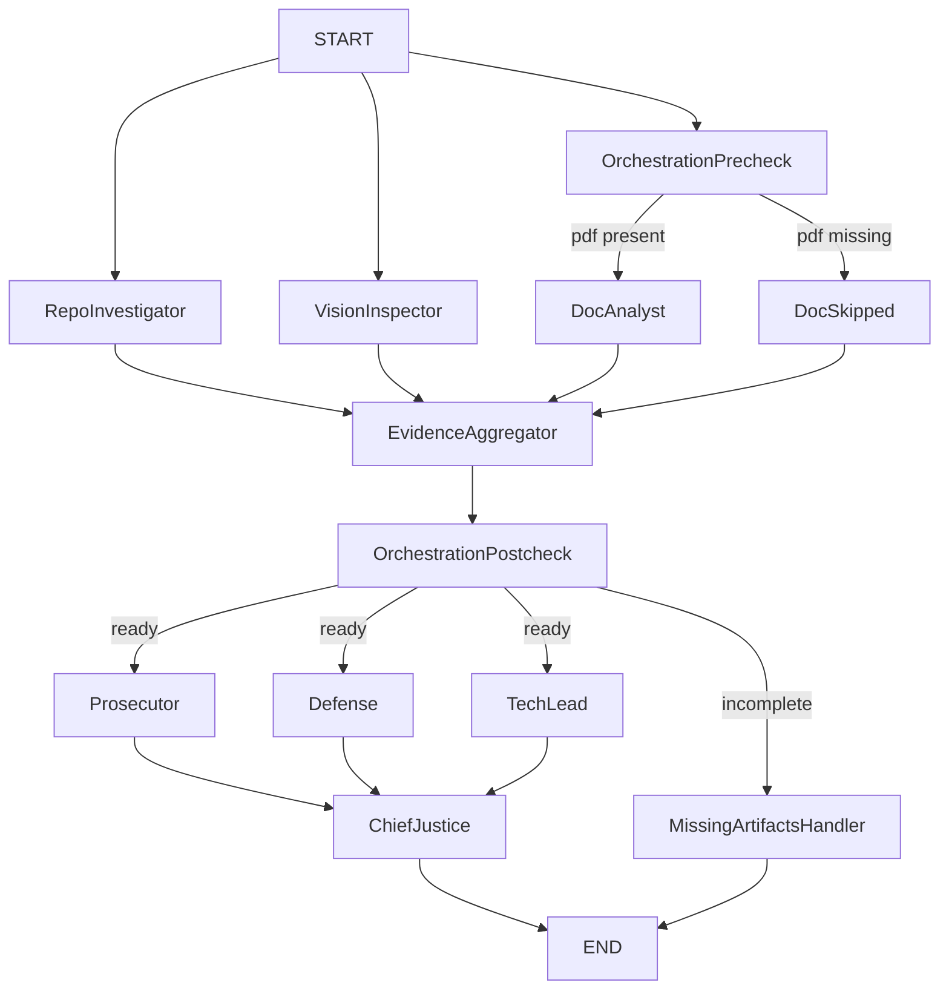

# Week 2 Final Report - The Automaton Auditor

## Executive Summary

This project implements a Deep LangGraph "Digital Courtroom" that audits a repository and its architecture report using parallel detective agents, parallel judicial agents, and deterministic Chief Justice synthesis rules.  
The final architecture enforces evidence-first reasoning, explicit dissent capture, and rule-based conflict resolution (security override, fact supremacy, variance re-evaluation).

## Architecture Deep Dive

### Dialectical Synthesis

Dialectical synthesis is implemented as a three-judge conflict engine:
- Prosecutor: adversarial, gap-finding, security-sensitive
- Defense: effort-aware and context-sensitive
- Tech Lead: architectural viability and maintainability

Each judge receives the same evidence for each criterion and emits structured `JudicialOpinion` objects.  
The Chief Justice applies deterministic rules to resolve disagreement into one final score per criterion.

### Fan-In / Fan-Out

Two fan-out/fan-in patterns are implemented:
- Detective layer:
  - `START -> RepoInvestigator || DocAnalyst/DocSkipped || VisionInspector`
  - Fan-in at `EvidenceAggregator`
- Judicial layer:
  - `OrchestrationPostcheck -> Prosecutor || Defense || TechLead`
  - Fan-in at `ChiefJustice`

### Metacognition

Metacognition is implemented as governance over governance:
- The system audits not only code artifacts but also claim quality and citation validity.
- Defense claims are cross-checked against factual evidence (`fact_supremacy` rule).
- High disagreement (variance > 2) triggers deterministic re-evaluation before final scoring.

## StateGraph Visualization

## Criterion-by-Criterion Self-Audit Summary

1. `git_forensic_analysis`: commit progression demonstrates iterative engineering.
2. `state_management_rigor`: typed state with reducers prevents parallel overwrite.
3. `graph_orchestration`: dual fan-out/fan-in with conditional routing implemented.
4. `safe_tool_engineering`: sandboxed clone + AST checks + subprocess error handling.
5. `structured_output_enforcement`: judges use structured schema-bound output.
6. `judicial_nuance`: distinct judicial personas and dissent tracking.
7. `chief_justice_synthesis`: deterministic Python conflict rules implemented.
8. `theoretical_depth`: architecture concepts grounded in execution design.
9. `report_accuracy`: report claims cross-referenced against repository paths.
10. `swarm_visual`: architecture flow visualized with explicit parallel branches.

## MinMax Reflection Loop

### What the peer's agent caught

- Conditional graph routing existed but did not fully prove error-path handling quality.
- Clone-failure scenarios were not routed based on evidence quality (`found=True/False`), only key presence.
- Documentation lagged behind implementation in some iterations.

### How this agent was improved

- Added evidence-quality aware conditional routing for missing artifacts.
- Added deterministic Chief Justice rules in `src/nodes/justice.py`.
- Added structured routing and governance logs for audit transparency.
- Added reproducibility hardening (CI + locked sync workflow + automation targets).

## Remediation Plan for Remaining Gaps

1. Keep improving visual-graph validation robustness for low-quality PDF diagrams.
2. Add stronger retry/backoff policy for external LLM/API calls.
3. Extend statistical dissent analytics across multiple audit runs.
4. Expand rubric-specific remediation templates at file-level granularity.

