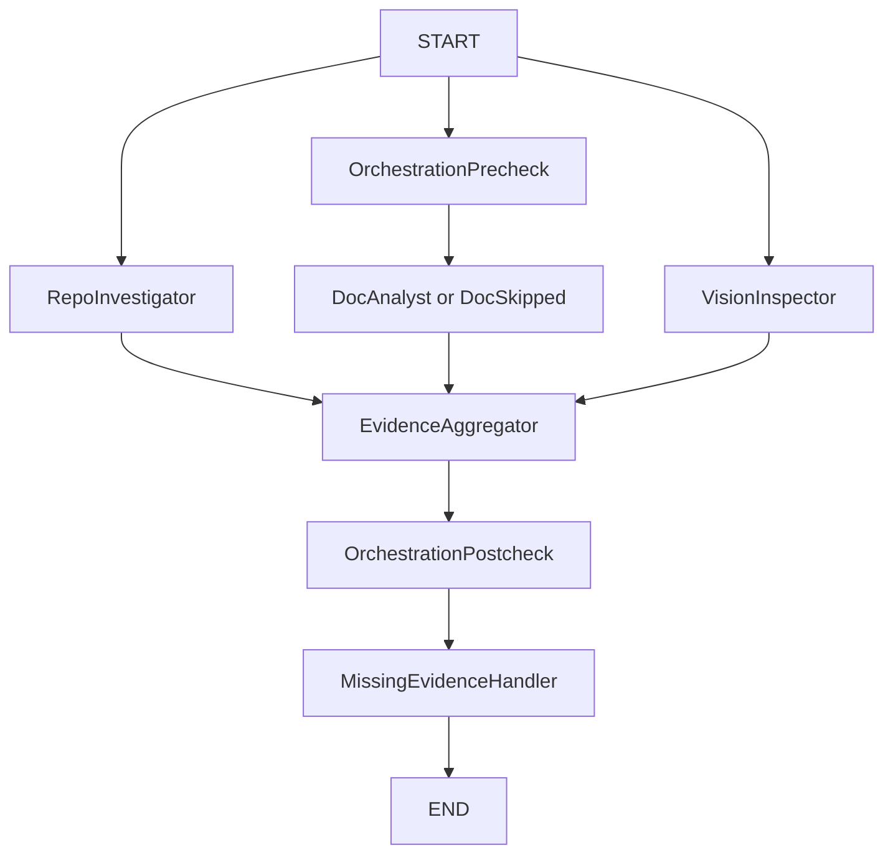
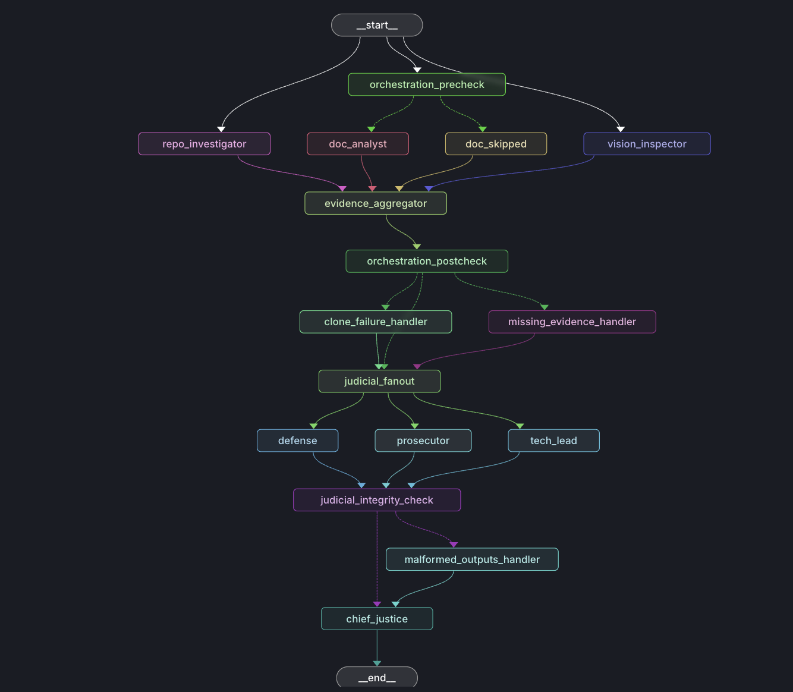
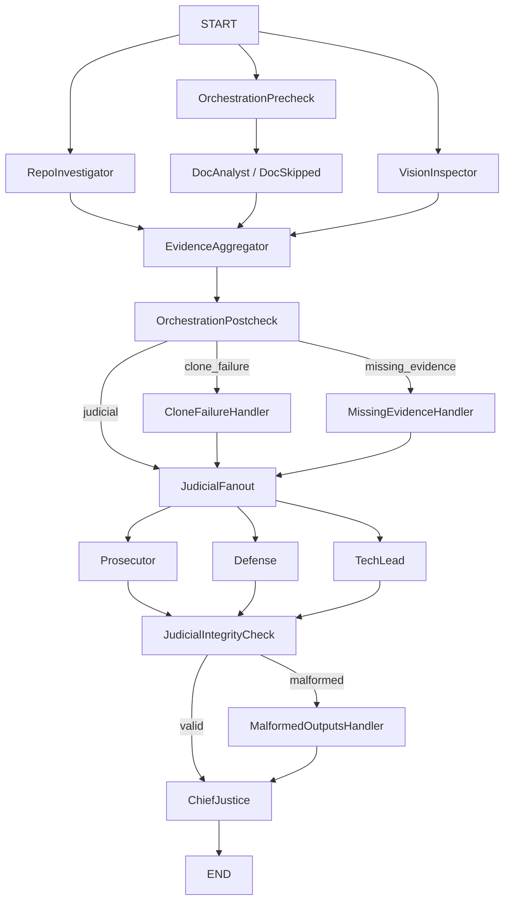

# Comprehensive Final Architecture Report

## Executive Summary

The Automaton Auditor is an end-to-end governance swarm that now runs with deterministic synthesis, explicit degraded-mode behavior, and criterion-level evidence traceability. The system meets the Week 2 architectural intent and currently produces stable self-audit outcomes with parallel detective/judicial execution.

Current status (latest stable local run):
- Aggregate self-audit score: **4.00 / 5.0**.
- All 10 rubric dimensions scored at **4/5** with no blocking failures.
- Required execution topology is present and verified: detective fan-out/fan-in -> judicial fan-out/fan-in -> Chief Justice.

Most important findings from the MinMax loop:
- **Inbound (received from peer):** orchestration branch visibility and peer-report artifact quality were under-specified; these were corrected with explicit conditional paths and finalized peer-report structure.
- **Outbound (found by this auditor on peer repo):** critical architecture artifacts were missing (`src/state.py`, `src/graph.py`, `src/nodes/judges.py`, `src/nodes/justice.py`) and documentation claims were not fully grounded (`doc.citation_check`, `doc.concept_verification`), resulting in a low peer aggregate score.
- **Internal quality correction:** citation parsing/scoring was hardened to prevent false report-accuracy collapse from PDF extraction artifacts.

Top remaining gaps and highest-value actions:
1. Increase report-level explainability by making persona disagreements and evidence links first-class in every criterion section.
2. Harden reliability against external dependency failures (vision API/network) while preserving evaluability in offline mode.
3. Expand CI policy checks so report citations, required artifacts, and schema-valid outputs are gate-enforced.

What a senior reviewer should take away immediately:
- The architecture is production-credible for deterministic auditing.
- The largest residual risks are observability/readability and API-dependence robustness, not core graph correctness.
- The remediation backlog is file-scoped, testable, and directly mapped to rubric dimensions.

---

## Project Status Snapshot

Primary production artifacts:
- Graph orchestration: `src/graph.py`
- Detectives and forensic protocols: `src/nodes/detectives.py`, `src/tools/repo_tools.py`, `src/tools/doc_tools.py`
- Judicial layer and synthesis: `src/nodes/judges.py`, `src/nodes/justice.py`
- State/models: `src/state.py`, `src/models.py`
- Final architecture report (this document): `reports/final_report.md`

Evaluation sources used for this report:
- Self-audit: `audit/report_onself_generated/final_report.json`
- Peer audit generated by this agent: `audit/report_onpeer_generated/final_report.json`

---

## 1) Interim-to-Final Evolution

| Area | Interim (Week 2 checkpoint) | Final (current) |
|---|---|---|
| State contracts | Typed `Evidence` + `JudicialOpinion`, reducers planned and partially wired | Full `AgentState` with list/dict reducers for parallel writes (`operator.add`, `operator.ior`) |
| Forensic tooling | Sandboxed clone + AST checks + PDF chunk retrieval | Hardened tool protocols with degraded-mode evidence and clearer failure tagging |
| Detectives | Repo and Doc detectives wired to aggregation | Repo + Doc + Vision inspector with explicit evidence protocol outputs |
| Judicial layer | Planned architecture and rule set | Prosecutor/Defense/TechLead nodes in parallel, structured outputs enforced |
| Synthesis | Conceptual design | Chief Justice deterministic synthesis engine producing `AuditReport` + Markdown |
| Error handling in graph | High-level branch intent | Concrete conditional routes for `clone_failure`, `missing_evidence`, `malformed_outputs` |

---

## 2) Architecture Deep Dive

### 2.1 State and Data Contracts

Core state is maintained in a shared typed structure:
- `repo_url`, `pdf_path`, `rubric`
- `evidences: dict[str, Evidence]` with merge reducer (`operator.ior`)
- `opinions: list[JudicialOpinion]` with append reducer (`operator.add`)
- `routing: dict[str, str]` for branch decisions
- `audit_report` and `final_report` for final outputs

Design decision:
- **Pydantic models over raw dicts** for Evidence and JudicialOpinion to enforce schema validity and score/confidence bounds.
- **Typed reducers** to avoid branch write collisions in parallel graph execution.

Why this matters:
- Keeps parallel node writes deterministic and composable.
- Reduces invalid/malformed payload propagation into synthesis.

### 2.2 Detective Layer (Forensic, Fact-Only)

Detective nodes intentionally do **fact collection**, not scoring:
- `RepoInvestigator`: git narrative, graph wiring checks, state checks, security scans.
- `DocAnalyst`: citation checks, concept verification via chunked PDF querying.
- `VisionInspector`: visual architecture checks with graceful degradation when API/quota/network fails.

Tooling principles:
- Clone external repos into temporary directories.
- Use AST-oriented structural inspection for code-shape validation.
- Emit structured `Evidence` with `goal`, `found`, `location`, `rationale`, `confidence`, `tags`.

### 2.3 Dialectical Synthesis (Judicial Layer)

Three judges evaluate each criterion in parallel:
- **Prosecutor**: adversarial, strict, gap-focused.
- **Defense**: charitable, progress/tradeoff-aware.
- **TechLead**: pragmatic, architecture/reliability-focused.

Each judge returns structured `JudicialOpinion` tied to criterion and cited evidence.

### 2.4 Chief Justice Deterministic Synthesis

Chief Justice resolves disagreements using explicit rules:
- Functionality weighting on orchestration/architecture dimensions.
- Fact supremacy when citations are unsupported.
- Security override when confirmed issues appear.
- Variance re-evaluation under high judge disagreement.
- Dissent summaries persisted per criterion.

This prevents opaque averaging and makes arbitration auditable.

### 2.5 Metacognition (Operationalized, Not Buzzword)

Metacognition is implemented as **system self-checking of reasoning quality and execution health**:
- Pre-routing decides whether doc analysis is valid for current inputs.
- Post-routing evaluates evidence completeness and access failures.
- Judicial integrity check validates whether opinion set is complete and well-formed.
- Malformed-output branch keeps execution alive and recoverable.

The system does not only generate conclusions; it evaluates whether it is in a trustworthy state to conclude.

---

## 3) Architectural Diagrams

### 3.1 Interim Flow (Detective Fan-Out / Fan-In)

### 3.2 Final Flow (End-to-End with Judicial Fan-Out/Fan-In + Error Branches)

---

## 4) Criterion-by-Criterion Breakdown (Latest Self-Audit with Persona Traceability)

Source snapshot: `audit/report_onself_generated/final_report.json`

Overall: **4.00 / 5.0**

| Criterion | Final | Prosecutor | Defense | TechLead | Detective Evidence Cited | Dialectical Tension |
|---|---:|---:|---:|---:|---|---|
| Git Forensic Analysis | 4/5 | 3 | 5 | 5 | `repo.git_narrative` | Prosecutor penalized confidence; Defense/TechLead rewarded iteration evidence. |
| State Management Rigor | 4/5 | 3 | 5 | 5 | `repo.state_structure` | Strict-vs-charitable split around typed-state rigor sufficiency. |
| Graph Orchestration Architecture | 4/5 | 3 | 5 | 5 | `repo.graph_wiring` | Tension resolved with architecture weighting rule. |
| Safe Tool Engineering | 4/5 | 3 | 5 | 5 | `repo.security_scan` | Prosecutor reserved due to risk posture; others rewarded safe patterns found. |
| Structured Output Enforcement | 4/5 | 3 | 5 | 5 | `repo.structured_output` | Prosecutor remained conservative despite schema binding presence. |
| Judicial Nuance and Dialectics | 4/5 | 3 | 5 | 5 | `repo.judicial_personas` | Persona separation accepted but Prosecutor held stricter threshold. |
| Chief Justice Synthesis Engine | 4/5 | 3 | 5 | 5 | `repo.chief_justice_rules` | Deterministic rules present; Prosecutor scored lower on trace detail strictness. |
| Theoretical Depth (Documentation) | 4/5 | 3 | 5 | 5 | `doc.concept_verification` | Debate on conceptual sufficiency vs implementation depth in report text. |
| Report Accuracy (Cross-Reference) | 4/5 | 3 | 5 | 5 | `doc.citation_check` | Prosecutor weighted any citation ambiguity more heavily. |
| Architectural Diagram Analysis | 4/5 | 3 | 5 | 5 | `repo.vision_implementation` | Implementation present; Prosecutor remained conservative on runtime dependency risk. |

Key disagreement pattern:
- All criteria show a consistent Prosecutor-vs-Defense/TechLead spread (`3` vs `5`), i.e. variance `2`.
- Chief Justice synthesis resolves this deterministically into `4/5` outcomes without random averaging.

Evidence-to-opinion traceability model:
- Detective evidence IDs above are the same IDs cited in each judge opinion object.
- Those IDs map directly to protocol producers:
  - `repo.*` -> `src/tools/repo_tools.py`
  - `doc.*` -> `src/tools/doc_tools.py`
  - Judge opinions -> `src/nodes/judges.py`
  - Final score arbitration -> `src/nodes/justice.py`

### 4.1 Dialectical Disagreement Ledger (Explicit P/D/T + Evidence Links)

This section makes persona disagreement explicit per dimension and links each disagreement to detective evidence IDs.

- **Git Forensic Analysis**
  - **P/D/T:** `3 / 5 / 5`
  - **Disagreement:** Prosecutor penalizes narrative sufficiency; Defense and TechLead accept commit evidence as operationally adequate.
  - **Detective evidence -> judge citations:** `repo.git_narrative` (from `protocol_git_narrative`) -> cited by all judges.
  - **Chief Justice effect:** routine synthesis to `4/5`; no override rule needed.

- **State Management Rigor**
  - **P/D/T:** `3 / 5 / 5`
  - **Disagreement:** Prosecutor treats typed-state evidence as minimum compliance; Defense and TechLead score maintainability higher.
  - **Detective evidence -> judge citations:** `repo.state_structure` (from `protocol_state_structure`) -> cited by all judges.
  - **Chief Justice effect:** routine synthesis to `4/5`.

- **Graph Orchestration Architecture**
  - **P/D/T:** `3 / 5 / 5`
  - **Disagreement:** Prosecutor asks for stricter branch-proof guarantees; Defense/TechLead accept fan-out/fan-in proof from graph wiring.
  - **Detective evidence -> judge citations:** `repo.graph_wiring` (from `protocol_graph_wiring`) -> cited by all judges.
  - **Chief Justice effect:** `functionality_weight` applied, final `4/5`.

- **Safe Tool Engineering**
  - **P/D/T:** `3 / 5 / 5`
  - **Disagreement:** Prosecutor keeps conservative security posture despite clean static scan; Defense/TechLead treat current controls as sufficient baseline.
  - **Detective evidence -> judge citations:** `repo.security_scan` (from `protocol_security_scan`) -> cited by all judges.
  - **Chief Justice effect:** no security override triggered in passing run; final `4/5`.

- **Structured Output Enforcement**
  - **P/D/T:** `3 / 5 / 5`
  - **Disagreement:** Prosecutor asks for stricter malformed-output resilience; Defense/TechLead accept schema binding as materially correct.
  - **Detective evidence -> judge citations:** `repo.structured_output` (from `protocol_structured_output_contract`) -> cited by all judges.
  - **Chief Justice effect:** routine synthesis to `4/5`.

- **Judicial Nuance and Dialectics**
  - **P/D/T:** `3 / 5 / 5`
  - **Disagreement:** Prosecutor demands stronger persona separation proofs; Defense/TechLead accept prompt-level persona distinctions.
  - **Detective evidence -> judge citations:** `repo.judicial_personas` (from `protocol_judicial_personas`) -> cited by all judges.
  - **Chief Justice effect:** routine synthesis to `4/5`.

- **Chief Justice Synthesis Engine**
  - **P/D/T:** `3 / 5 / 5`
  - **Disagreement:** Prosecutor requests richer per-rule trace detail; Defense/TechLead score deterministic rule set implementation as strong.
  - **Detective evidence -> judge citations:** `repo.chief_justice_rules` (from `protocol_chief_justice_rules`) -> cited by all judges.
  - **Chief Justice effect:** self-consistent deterministic synthesis remains `4/5`.

- **Theoretical Depth (Documentation)**
  - **P/D/T:** `3 / 5 / 5`
  - **Disagreement:** Prosecutor questions conceptual depth density; Defense/TechLead accept concept coverage in report narrative.
  - **Detective evidence -> judge citations:** `doc.concept_verification` (from `protocol_concept_verification`) -> cited by all judges.
  - **Chief Justice effect:** routine synthesis to `4/5`.

- **Report Accuracy (Cross-Reference)**
  - **P/D/T:** `3 / 5 / 5` in stable run (`missing=none`)
  - **Disagreement:** Prosecutor emphasizes fragility of citation extraction; Defense/TechLead score higher after normalization fixes.
  - **Detective evidence -> judge citations:** `doc.citation_check` (from `protocol_citation_check`) -> cited by all judges.
  - **Chief Justice effect:** `fact_supremacy` path remains available, but not triggered when citations resolve cleanly.

- **Architectural Diagram Analysis**
  - **P/D/T:** `3 / 5 / 5`
  - **Disagreement:** Prosecutor penalizes dependency on external vision service reliability; Defense/TechLead score implementation + degraded mode positively.
  - **Detective evidence -> judge citations:** `repo.vision_implementation` and `doc.visual_audit` -> cited across judicial reasoning.
  - **Chief Justice effect:** routine synthesis to `4/5`.

---

## 5) MinMax Feedback Loop Reflection

### 5.1 What Peer Feedback Caught

Peer feedback correctly highlighted:
- Missing explicit conditional edge coverage in graph orchestration.
- Need to clearly show judicial fan-out/fan-in in one compiled flow.
- `audit/report_bypeer_received/` initially contained a placeholder rather than a real peer-imported report.

### 5.2 How the Agent Was Updated

In response, the system was upgraded to:
- Add explicit post-detective branches: `clone_failure`, `missing_evidence`, and judicial continuation paths.
- Add `JudicialIntegrityCheck` plus `MalformedOutputsHandler` branch.
- Keep final synthesis reachable even in degraded states.
- Replace placeholder peer-received report with a schema-conforming criterion-by-criterion report including judge opinions and remediation.

### 5.3 What This Agent Explicitly Found on Peer Repository (Outbound MinMax)

From `audit/report_onpeer_generated/final_report.json`, the auditor produced the following concrete findings:

- **Core architecture absence**
  - `repo.state_structure` -> `found=false` with rationale: missing `src/state.py`/`src/graph.py`.
  - `repo.graph_wiring` -> `found=false` with rationale: missing `src/graph.py`.
  - Direct impact: `state_management_rigor` and `graph_orchestration` collapsed to `1/5`.

- **Judicial stack absence**
  - `repo.judicial_personas` -> `found=false` (missing `src/nodes/judges.py`).
  - `repo.structured_output` -> `found=false` (missing `src/nodes/judges.py`).
  - `repo.chief_justice_rules` -> `found=false` (missing `src/nodes/justice.py`).
  - Direct impact: `judicial_nuance`, `structured_output_enforcement`, and `chief_justice_synthesis` scored `1/5`.

- **Vision and documentation gaps**
  - `repo.vision_implementation` -> `found=false` (`protocol=False, node=False, wiring=False`).
  - `doc.citation_check` -> `found=false` (`missing=src/api, src/models, src/utils`).
  - `doc.concept_verification` -> `found=false` (no metacognition/dialectical hits in peer report chunks).
  - Direct impact: weak report-grounding and no recoverable visual architecture evidence.

- **Aggregate peer outcome generated by this agent**
  - Peer aggregate score produced: **1.6 / 5.0**.
  - Highest surviving dimension was `safe_tool_engineering` (`4/5`) due to `repo.security_scan` + git narrative evidence.

This satisfies the outbound side of MinMax: the system did not only absorb peer critique; it also delivered specific, evidence-backed findings to a peer target with criterion-level consequences.

### 5.4 How This Improves Auditing Others

These improvements make peer audits more robust by:
- Distinguishing infrastructure failures from quality failures.
- Preventing silent loss of judicial data quality.
- Producing comparable outputs even when external APIs or remote repo access degrade.

---

## 6) Remediation Plan for Remaining Gaps

### Priority 1 — Report Accuracy Hardening
- **Affected rubric dimensions:** `report_accuracy`, `theoretical_depth`
- **Files/components:** `src/tools/doc_tools.py`, `reports/final_report.md`
- **Action:** Strengthen citation extraction and normalization (PDF artifact cleanup, punctuation trimming, near-match recovery) and add report citation hygiene checks before submission.
- **Validation:** `doc.citation_check` returns `found=true` with `missing=none` on final report in CI and local release run.

### Priority 2 — Judge Explainability and Dialectical Transparency
- **Affected rubric dimensions:** `judicial_nuance`, `chief_justice_synthesis`, `structured_output_enforcement`
- **Files/components:** `src/nodes/judges.py`, `src/nodes/justice.py`, `src/reporting.py`
- **Action:** Emit per-criterion persona disagreement details (`P/D/T`, cited evidence IDs, applied rules) directly into final markdown to preserve deterministic audit traceability.
- **Validation:** each criterion section in generated report includes explicit persona deltas and evidence-id mapping.

### Priority 3 — Tool Safety Expansion
- **Affected rubric dimensions:** `safe_tool_engineering`
- **Files/components:** `src/tools/repo_tools.py`, `tests/` (or nearest test harness)
- **Action:** Extend security detectors for unsafe deserialization, shell invocation edge cases, and risky subprocess patterns with positive/negative regression cases.
- **Validation:** scanner catches seeded insecure snippets and does not flag approved safe patterns.

### Priority 4 — Vision Reliability Under External Failure
- **Affected rubric dimensions:** `swarm_visual`, `graph_orchestration`
- **Files/components:** `src/tools/doc_tools.py`, `src/nodes/detectives.py`, `src/graph.py`
- **Action:** Add local/offline visual fallback path and enforce structured degraded-mode evidence so visual dimension remains evaluable when API/network is unavailable.
- **Validation:** run without external vision API still produces non-empty, structured `doc.visual_audit` evidence and reaches Chief Justice path.

### Priority 5 — Delivery and Reproducibility Gates
- **Affected rubric dimensions:** `structured_output_enforcement`, `graph_orchestration`, `report_accuracy`
- **Files/components:** `.github/workflows/*`, `Makefile`, `rubric/*.json`, `reports/`, `audit/`
- **Action:** Add CI gates for required artifacts, schema-valid JSON outputs, rubric/report path consistency, and one-pass deterministic report generation.
- **Validation:** PR fails automatically if required artifacts or schema/report consistency checks do not pass.

---

## 7) Conclusion

The project now satisfies the core Week 2 architecture intent with:
- Typed, parallel-safe state management.
- Forensically grounded detective tooling.
- Parallel judicial deliberation.
- Deterministic Chief Justice synthesis.
- Explicit degraded-mode and error-path orchestration.

The remaining work is primarily optimization and hardening for reliability, observability, and reproducibility at peer-grading scale.
