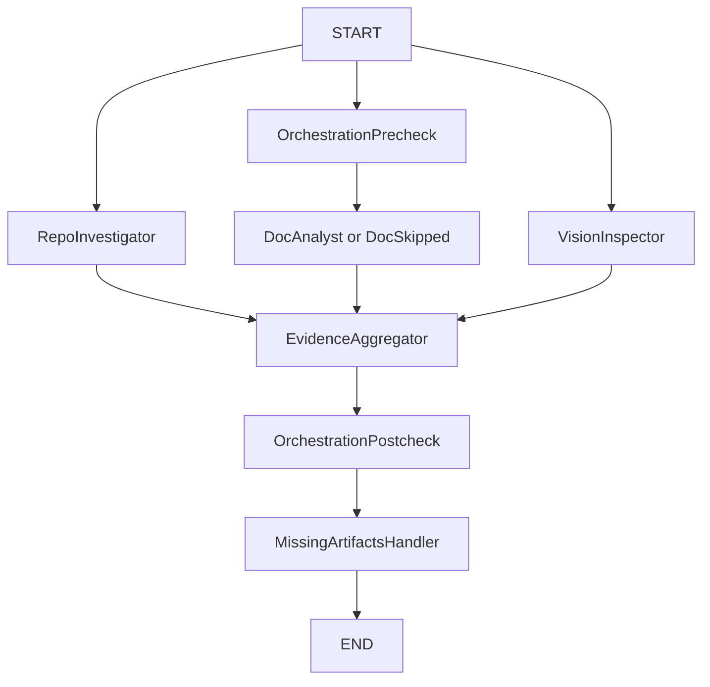
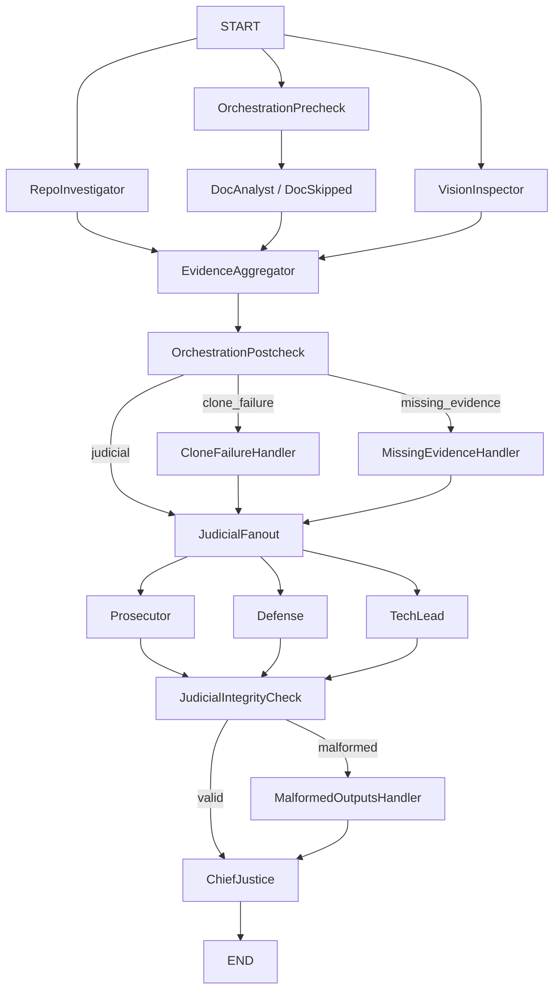

# Comprehensive Final Architecture Report

## Executive Summary

This report consolidates the Week 2 interim and final phases of **The Automaton Auditor** project as of **February 28, 2026**.

Interim phase outcome:
- Established typed state and evidence contracts.
- Built sandboxed forensic tools for repository and PDF analysis.
- Implemented detective fan-out/fan-in pattern and documented planned judicial synthesis.

Final phase outcome:
- Delivered full end-to-end StateGraph from repo/PDF input to rendered Markdown audit report.
- Added judicial fan-out/fan-in with three distinct judge personas.
- Added deterministic Chief Justice synthesis with explicit conflict-resolution rules.
- Added explicit conditional branches for clone failure, missing evidence, and malformed judicial output handling.

Latest self-audit aggregate score: **4.00 / 5.0**.

---

## Report Scope (Interim + Final)

This document synthesizes both project stages:

- **Interim phase report basis (February 24-25, 2026):**
  - `reports/interim_report.txt`
  - `reports/interim_report.pdf`
  - Focus: detective architecture, typed state direction, and planned judicial synthesis.

- **Final phase report basis (February 28, 2026):**
  - `audit/report_onself_generated/final_report_20260228_142434.json`
  - `audit/report_onself_generated/final_report_20260228_142434.md`
  - Focus: full end-to-end execution with detectives, judges, and Chief Justice final verdict.

---

## 1) Interim-to-Final Evolution

| Area | Interim (Week 2 checkpoint) | Final (current) |
|---|---|---|
| State contracts | Typed `Evidence` + `JudicialOpinion`, reducers planned and partially wired | Full `AgentState` with list/dict reducers for parallel writes (`operator.add`, `operator.ior`) |
| Forensic tooling | Sandboxed clone + AST checks + PDF chunk retrieval | Hardened tool protocols with degraded-mode evidence and clearer failure tagging |
| Detectives | Repo and Doc detectives wired to aggregation | Repo + Doc + Vision inspector with explicit evidence protocol outputs |
| Judicial layer | Planned architecture and rule set | Prosecutor/Defense/TechLead nodes in parallel, structured outputs enforced |
| Synthesis | Conceptual design | Chief Justice deterministic synthesis engine producing `AuditReport` + Markdown |
| Error handling in graph | High-level branch intent | Concrete conditional routes for `clone_failure`, `missing_evidence`, `malformed_outputs` |

---

## 2) Architecture Deep Dive

### 2.1 State and Data Contracts

Core state is maintained in a shared typed structure:
- `repo_url`, `pdf_path`, `rubric`
- `evidences: dict[str, Evidence]` with merge reducer (`operator.ior`)
- `opinions: list[JudicialOpinion]` with append reducer (`operator.add`)
- `routing: dict[str, str]` for branch decisions
- `audit_report` and `final_report` for final outputs

Design decision:
- **Pydantic models over raw dicts** for Evidence and JudicialOpinion to enforce schema validity and score/confidence bounds.
- **Typed reducers** to avoid branch write collisions in parallel graph execution.

Why this matters:
- Keeps parallel node writes deterministic and composable.
- Reduces invalid/malformed payload propagation into synthesis.

### 2.2 Detective Layer (Forensic, Fact-Only)

Detective nodes intentionally do **fact collection**, not scoring:
- `RepoInvestigator`: git narrative, graph wiring checks, state checks, security scans.
- `DocAnalyst`: citation checks, concept verification via chunked PDF querying.
- `VisionInspector`: visual architecture checks with graceful degradation when API/quota/network fails.

Tooling principles:
- Clone external repos into temporary directories.
- Use AST-oriented structural inspection for code-shape validation.
- Emit structured `Evidence` with `goal`, `found`, `location`, `rationale`, `confidence`, `tags`.

### 2.3 Dialectical Synthesis (Judicial Layer)

Three judges evaluate each criterion in parallel:
- **Prosecutor**: adversarial, strict, gap-focused.
- **Defense**: charitable, progress/tradeoff-aware.
- **TechLead**: pragmatic, architecture/reliability-focused.

Each judge returns structured `JudicialOpinion` tied to criterion and cited evidence.

### 2.4 Chief Justice Deterministic Synthesis

Chief Justice resolves disagreements using explicit rules:
- Functionality weighting on orchestration/architecture dimensions.
- Fact supremacy when citations are unsupported.
- Security override when confirmed issues appear.
- Variance re-evaluation under high judge disagreement.
- Dissent summaries persisted per criterion.

This prevents opaque averaging and makes arbitration auditable.

### 2.5 Metacognition (Operationalized, Not Buzzword)

Metacognition is implemented as **system self-checking of reasoning quality and execution health**:
- Pre-routing decides whether doc analysis is valid for current inputs.
- Post-routing evaluates evidence completeness and access failures.
- Judicial integrity check validates whether opinion set is complete and well-formed.
- Malformed-output branch keeps execution alive and recoverable.

The system does not only generate conclusions; it evaluates whether it is in a trustworthy state to conclude.

---

## 3) Architectural Diagrams

### 3.1 Interim Flow (Detective Fan-Out / Fan-In)

### 3.2 Final Flow (End-to-End with Judicial Fan-Out/Fan-In + Error Branches)

---

## 4) Criterion-by-Criterion Breakdown (Latest Self-Audit)

Source snapshot: `audit/report_onself_generated/final_report_20260228_142434.json`

Overall: **4.00 / 5.0**

| Criterion | Score | Key Rule Signals |
|---|---:|---|
| Git Forensic Analysis | 4/5 | `variance_re_evaluation` |
| State Management Rigor | 4/5 | `variance_re_evaluation` |
| Graph Orchestration Architecture | 4/5 | `functionality_weight`, `variance_re_evaluation` |
| Safe Tool Engineering | 4/5 | `variance_re_evaluation` |
| Structured Output Enforcement | 4/5 | `variance_re_evaluation` |
| Judicial Nuance and Dialectics | 4/5 | `variance_re_evaluation` |
| Chief Justice Synthesis Engine | 4/5 | `variance_re_evaluation` |
| Theoretical Depth (Documentation) | 4/5 | `variance_re_evaluation` |
| Report Accuracy (Cross-Reference) | 4/5 | `variance_re_evaluation` |
| Architectural Diagram Analysis | 4/5 | `variance_re_evaluation` |

Interpretation:
- The stack is consistently solid across dimensions.
- The dominant pattern is judge variance handling rather than severe functional failures.
- Architecture criterion received additional functionality weighting as intended.

---

## 5) MinMax Feedback Loop Reflection

### 5.1 What Peer Feedback Caught

Peer feedback correctly highlighted:
- Missing explicit conditional edge coverage in graph orchestration.
- Need to clearly show judicial fan-out/fan-in in one compiled flow.
- `audit/report_bypeer_received/` initially contained a placeholder rather than a real peer-imported report.

### 5.2 How the Agent Was Updated

In response, the system was upgraded to:
- Add explicit post-detective branches: `clone_failure`, `missing_evidence`, and judicial continuation paths.
- Add `JudicialIntegrityCheck` plus `MalformedOutputsHandler` branch.
- Keep final synthesis reachable even in degraded states.
- Replace placeholder peer-received report with a schema-conforming criterion-by-criterion report including judge opinions and remediation.

### 5.3 How This Improves Auditing Others

These improvements make peer audits more robust by:
- Distinguishing infrastructure failures from quality failures.
- Preventing silent loss of judicial data quality.
- Producing comparable outputs even when external APIs or remote repo access degrade.

---

## 6) Remediation Plan for Remaining Gaps

### Priority 1: Improve Cross-Detective Grounding
Action:
- Add direct linkage from doc citations to verified code locations (file + line evidence mapping).

Why:
- Increases trust in documentation-to-code consistency and reduces false-positive citation drift.

### Priority 2: Expand Security Detector Depth
Action:
- Add deeper static checks for command execution surfaces, unsafe deserialization, and secrets handling patterns.

Why:
- Current security checks are safe and structured but can be broadened to detect subtler risks.

### Priority 3: Strengthen Vision Reliability
Action:
- Add local non-LLM diagram heuristics/cache path when external vision quota/network is unavailable.

Why:
- Keeps architectural diagram scoring stable under API quota or connectivity volatility.

### Priority 4: Reduce Duplicate Branch Invocations
Action:
- Add idempotency guards for routing/aggregation logs and ensure single-pass synthesis in concurrent edge convergence.

Why:
- Improves trace readability and avoids repeated log noise in parallel execution traces.

### Priority 5: CI-Level Submission Guardrails
Action:
- Add CI checks to validate:
  - required folders/files for submission,
  - report-cited file existence,
  - schema compliance for generated and received reports.

Why:
- Prevents rubric penalties caused by packaging or artifact-format drift.

---

## 7) Conclusion

The project now satisfies the core Week 2 architecture intent with:
- Typed, parallel-safe state management.
- Forensically grounded detective tooling.
- Parallel judicial deliberation.
- Deterministic Chief Justice synthesis.
- Explicit degraded-mode and error-path orchestration.

The remaining work is primarily optimization and hardening for reliability, observability, and reproducibility at peer-grading scale.
