# TRP1 Week 2 Interim Report

**Project:** The Automaton Auditor (Digital Courtroom)  
**Repository:** repository root (`.`)  
**Date:** 2026-02-24

## 1) Architecture Decisions Made So Far

### 1.1 State Management: Pydantic over Plain Dicts

We chose strict data contracts for agent payloads (`Evidence`, `JudicialOpinion`) instead of passing completely unstructured dictionaries between nodes.

**Decision & Implementation:**
- Use Pydantic `BaseModel` for all core data structures.
- Define LangGraph state as a `TypedDict` (`AgentState`).
- Utilize built-in reducers (`Annotated[dict[str, Evidence], operator.ior]` and `Annotated[list[JudicialOpinion], operator.add]`) to aggregate data cleanly across parallel edges.

**Trade-off Analysis & Alternatives Rejected:**
- *Alternative Considered:* Plain Python `dict` objects. *Rejected because:* Modifying shared dictionary state across parallel nodes often leads to silent overwrites and race conditions. Without schema enforcement, a detective might emit a `status` key instead of `score`, causing downstream judges to crash or hallucinate.
- *Failure Mode Prevented:* Pydantic entirely eliminates data schema drift. If a detective node fails to provide a required field, the validation error is caught immediately at the node boundary, preventing cascading logic failures in the synthesis stage.

---

### 1.2 Repository Protocol Forensics: AST Parsing Strategy

To analyze the repository structure, code patterns, and topology, we rely heavily on Python's Abstract Syntax Tree (`ast`) module.

**Decision & Implementation:**
- Load potential target files into an `ast.parse()` tree.
- Use `ast.walk` to traverse the tree hunting for specific node types (e.g., `ast.Call` where the function is `add_edge`).

**Trade-off Analysis & Alternatives Rejected:**
- *Alternative Considered:* Regular Expressions (`regex`). *Rejected because:* Regex is inherently brittle when dealing with code structure. A multiline list definition or trailing comments can break a regex matcher entirely. Furthermore, regex cannot reliably distinguish between commented-out logic and executed code.
- *Failure Mode Prevented:* Regex breaks on multiline class definitions or complex string manipulation. AST parsing natively handles nested language structures, reliably guaranteeing that we find active `add_edge` orchestrations or unsafe execution primitives (`subprocess.Popen` without sandboxing).

---

### 1.3 Security & Execution: Sandboxing Strategy

To run repository investigations safely, we treat peer codebases as untrusted execution environments.

**Decision & Implementation:**
- Clone external git repositories into isolated temporary directories using Python's `tempfile.TemporaryDirectory()`.
- Execute all local commands utilizing `subprocess.run([...], check=False, capture_output=True, text=True)` with explicit argument arrays.
- Guarantee cleanup using comprehensive `try...finally` blocks.

**Trade-off Analysis & Alternatives Rejected:**
- *Alternative Considered:* Cloning directly into the local workspace (e.g., `tmp/`) and using `os.system()` with constructed bash strings. *Rejected because:* Constructing bash strings leaves the system vulnerable to shell execution injection. Furthermore, local cloning risks permanent filesystem pollution if cleanup operations fail or the application crashes mid-execution.
- *Failure Mode Prevented:* By decoupling the git target from the local working tree and using explicit argument arrays in `subprocess`, we neutralize potential shell-injection attacks embedded in peer repository metadata, securing the agent runner infrastructure.

---

### 1.4 Conceptual grounding (for DocAnalyst checks)

This interim architecture is intentionally framed around **Dialectical Synthesis**, **Metacognition**, **Fan-In/Fan-Out**, and **State Synchronization**.

- **Dialectical Synthesis:** the planned judicial bench is designed to produce conflicting arguments (Prosecutor vs Defense vs Tech Lead), then resolve them through deterministic synthesis.
- **Metacognition:** the system evaluates not just generated artifacts but the quality of reasoning used to produce those artifacts.
- **Fan-In/Fan-Out:** detectives run in parallel fan-out branches, then synchronize at a fan-in aggregation point before downstream reasoning.
- **State Synchronization:** typed shared state and reducers are used so concurrent node updates do not overwrite evidence.

---

## 2) Known Gaps and Concrete Plan

### 2.1 Known Gaps (Current State)
1. **Graph Synchronization:** We have successfully built the upstream `EvidenceAggregator` fan-in, but conditional edges for handling downstream error paths (e.g., detective failure, incomplete evidence state) are not deeply wired.
2. **Missing Judicial Module:** Final submission spec calls for a dedicated justice-node module for conflict resolution; the current synthesis logic sits statically in `supreme_court.py` and is untested with live LLM inputs.

---

### 2.2 Granular Implementation Plan: Judicial Layer & Synthesis Engine

To progress from the interim foundation to a fully operative digital courtroom, we have a sequenced, granular plan focused on ensuring persona adherence, structured output, and deterministic synthesis.

#### Phase A: Judicial Layer Hardening (Fan-Out)

**Objective**: Guarantee that three distinct LLM personae run in parallel and emit strict, parseable contracts without converging.
1. **Persona Differentiation**: Prompt the `Prosecutor` (critical, focuses on flaws/security), `Defense` (charitable, focuses on intent/context), and `TechLead` (pragmatic, focuses on architecture viability) uniquely. 
    *   *Risk:* LLM may ignore persona constraints and converge to similar, generic opinions.
    *   *Mitigation:* Pre-inject strong persona-defining context sequences using LangChain `SystemMessages`. Implement a post-generation validation step that explicitly calculates opinion variance.
2. **Parallel Execution**: Wire the `add_edge("evidence_aggregator", [PJ, DJ, TL])` inside `src/graph.py` to fan-out execution.
3. **Structured Output Enforcement**: Force the LLM to map responses back to Pydantic definitions (`JudicialOpinion`).
    *   *Risk:* The LLM returns markdown format instead of strictly typed JSON.
    *   *Mitigation:* Use `.with_structured_output()` natively in LangChain. 

**Acceptance Criteria for Phase A**: 3 strictly formatted `JudicialOpinion` objects are stored to the state list (`opinions: operator.add`) per criterion, avoiding generic convergence.

#### Phase B: Synthesis Engine Hardening (Fan-In)

**Objective**: Funnel opinions into the `ChiefJusticeNode` and apply absolute, deterministic scoring rules, eliminating opaque "LLM vibe-checks".
1. **Explicit Hardcoded Rules**: Implement precedence logic. 
   - *Fact Supremacy:* If objective `Evidence` explicitly contradicts an LLM's heuristic opinion, the evidence always overrides.
   - *Security Override:* Implement an absolute ceiling. If the `repo.security_scan` flags a violation, the Chief Justice caps the overall score to a maximum of `3.0`, regardless of how strongly the Defense advocates.
2. **Dissent Generation & Variance Re-evaluation**: 
   - *Risk:* Raw score averaging ignores underlying contextual disagreement. 
   - *Mitigation:* Loop through `opinions` per criterion. If the Prosecutor's score `-` Defense's score `> 2`, trigger a mandatory Dissent Generation step. If variance is high, explicitly log the conflict to the `dissent` string instead of blending it.
3. **Remediation Plan Output**: Pass all validated `CriterionVerdict` objects into a markdown/json generator for the final report.

**Acceptance Criteria for Phase B**: The final score is clearly mapped from deterministic rules, logging all major dissenting arguments when variance is detected.

---

## 3) Planned StateGraph Diagram (Fan-Out/Fan-In Flows)

The digital courtroom relies on dual parallel patterns: one for data collection (`Evidence`) and one for subjective evaluation (`JudicialOpinion`).

### 3.1 Mermaid flow diagram

```mermaid
flowchart TD
    %% Define Node Styles
    classDef startEnd fill:#10b981,stroke:#047857,stroke-width:2px,color:#fff;
    classDef sync fill:#f59e0b,stroke:#d97706,stroke-width:2px,color:#fff;
    classDef detective fill:#3b82f6,stroke:#1d4ed8,stroke-width:2px,color:#fff;
    classDef judge fill:#8b5cf6,stroke:#6d28d9,stroke-width:2px,color:#fff;
    classDef justice fill:#ef4444,stroke:#dc2626,stroke-width:2px,color:#fff;

    START(["🟢 START"]):::startEnd
    
    %% Phase 1: Detective Fan-Out
    subgraph Phase 1: Investigation
        RI["🕵️‍♂️ RepoInvestigator"]:::detective
        DA["📄 DocAnalyst"]:::detective
        VI["👁️ VisionInspector"]:::detective
    end
    
    START -->|AgentState| RI
    START -->|AgentState| DA
    START -->|AgentState| VI

    %% Phase 2: Evidence Sync
    EA{"⚖️ EvidenceAggregator<br/>(Fan-in Sync)"}:::sync
    RI -- "evidences (dict[str, Evidence])" --> EA
    DA -- "evidences (dict[str, Evidence])" --> EA
    VI -- "evidences (dict[str, Evidence])" --> EA
    
    %% Conditional Check
    EA -- "evidence_ready" --> PJ
    EA -- "evidence_ready" --> DJ
    EA -- "evidence_ready" --> TL
    
    %% Error Path
    EA -- "detective_failed / missing_evidence" --> CJ

    %% Phase 3: Judicial Fan-Out
    subgraph Phase 3: Judicial Debate
        PJ["⚖️ Prosecutor Node"]:::judge
        DJ["🛡️ Defense Node"]:::judge
        TL["💻 TechLead Node"]:::judge
    end

    %% Phase 4: Resolution Sync
    CJ{"🏛️ ChiefJusticeNode<br/>(Fan-in Sync)"}:::justice
    PJ -- "opinions (list[JudicialOpinion])" --> CJ
    DJ -- "opinions (list[JudicialOpinion])" --> CJ
    TL -- "opinions (list[JudicialOpinion])" --> CJ

    CJ -->|"final_verdict (FinalVerdict)"| END(["🔴 END"]):::startEnd
```

### 3.2 Key Flow Characteristics:
1.  **Dual Synchronization Branches:** The graph explicitly uses two fan-in nodes (`EvidenceAggregator` and `ChiefJusticeNode`) to ensure all parallel nodes finish before downstream components evaluate them.
2.  **Data Payload Flow:** Notice that detectives append payloads strictly defined as `dict[str, Evidence]` into the shared state using `operator.ior`. Once validated, the Judges ingest that Evidence and append `list[JudicialOpinion]` using `operator.add`.
3.  **Error Paths:** The `EvidenceAggregator` serves as an active conditional gate. If an upstream detective crashes and fails to deliver core data (e.g., `repo.state_structure`), it routes directly to the `ChiefJusticeNode` via the `detective_failed / missing_evidence` conditional edge, bypassing subjective judicial loops entirely to fail gracefully and securely.

---

## 4) Next Checkpoint Deliverables

Before final submission, this interim plan will be considered complete when:

1. Architecture and contracts are reflected in code structure and graph edges.
2. Judicial validator + retry behavior is observable in execution traces.
3. Deterministic synthesis rule table is implemented and tested on disagreement scenarios.
4. Audit output includes criterion-level judicial evidence and actionable remediation.
